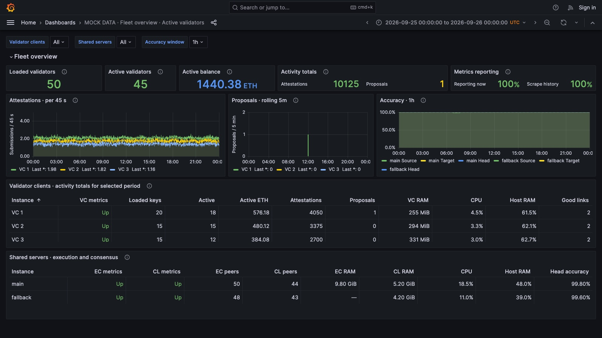

# Lido Grafana

Monitor a fleet of Nimbus validator clients from one Grafana dashboard: validator
activity, proposals, attestation accuracy, active validator counts, ETH balances,
peers, CPU, memory, and storage.
Shared Nimbus beacon nodes and Nethermind/Geth execution clients have their own
sections alongside the validator-client overviews.



## How it works

Choose one server as the **hub**; it can host a validator, a beacon/execution node,
or just monitoring. It runs Grafana, Prometheus, a host
exporter, and SSH tunnels to the other servers—the **children**. Each child runs
an exporter alongside its existing validator client. This stack monitors your
clients; it does not install or manage the validators themselves.

The hub's client list controls the dashboard automatically:

| Configuration | Client overviews |
| --- | ---: |
| Hub with local validator + one child | 2 |
| Hub with local validator + two children | 3 |
| Hub without local validator + three children | 3 |
| Hub without local validator + five children | 5 |

Add or remove entries in `CHILDREN` to change the fleet size. No manual dashboard
duplication is needed. Configured clients that go offline remain visible as
unavailable.

The deployment supports an optional local validator client on the hub and
additional clients over SSH, with shared main/fallback backends. Multiple client
processes on one machine and a backend without a fallback are not yet supported
as dedicated configuration modes.

## Restricted SSH access

Use a dedicated monitoring account on each child and a monitoring-only key on
the hub. The account should have no sudo privileges, Docker access, privileged
group memberships, or access to validator secrets. Keep administrator accounts
and validator-duty tunnels separate from this monitoring access.

Enforce restrictions in each child's SSH daemon, scoped to the monitoring
account: `MaxSessions 0` blocks shells, command execution and SFTP;
`AllowTcpForwarding local` allows only local forwarding; and `PermitOpen` limits
destinations to the child's confirmed metrics listeners (by default,
`127.0.0.1:8808` and `127.0.0.1:19103`). Disable Unix-socket, agent, X11 and tunnel
device forwarding as well. A disabled login shell or an authorized-key
`restrict` option alone is not a substitute for the server policy. See the
[OpenSSH server reference](https://man.openbsd.org/sshd_config).

Keep the private key on the hub with restrictive file permissions and mount it
only into the tunnel container. A read-only mount prevents modification, not
use or copying of the key. Verify child host keys using a trusted connection.
Source-IP restrictions on the authorized key are optional additional protection.
Before relying on the policy, verify that metrics requests succeed while
commands, SFTP, other destinations and reverse forwarding are denied.

These are host-side controls; they do not require rebuilding the image. They
allow TCP access to the approved services, not just HTTP requests to `/metrics`,
so allowlist dedicated metrics endpoints only. They also do not isolate the
hub's host network or limit monitoring resource usage; those require separate
deployment controls.

## Getting started

You need Linux servers with Docker Engine and Docker Compose 2.20+, enabled
client metrics, and SSH access from the hub to its children. The shared backend
metrics must already be reachable from the hub; see the
[deployment guide](deployment/README.md) for endpoint and tunnel configuration.

### 1. Get two files on each server

Create a directory and save [compose.yml](compose.yml) and
[.env.example](.env.example) there, naming the latter `.env`. No repository
checkout, extra Compose files, local dashboard files, or build is needed.
The hub also needs its own SSH key and verified known-hosts file.

```bash
chmod 600 .env
```

### 2. Choose each server's role

On a **child**, the essential settings are:

```dotenv
HUB=false
COMPOSE_PROFILES=${HUB:-false}
NODE_EXPORTER_PORT=19103
```

Keep the automatic `COMPOSE_PROFILES` line unchanged on both roles; change only
`HUB`. It selects the services without a command-line profile flag.

This is a complete child `.env`. Compose pulls the standard
`prom/node-exporter` image specified in `compose.yml`; the child does not use
`CONTROL_IMAGE` or run Grafana, Prometheus, or the tunnel controller. Its existing
Nimbus validator and host SSH daemon remain independently managed. The hub
initiates the SSH connection and configures the child's display name and metrics
destinations. No other `.env` entries are required on the child.

On the **hub**, a minimal example for one child looks like this:

```dotenv
HUB=true
COMPOSE_PROFILES=${HUB:-false}
LOCAL_VALIDATOR_ENABLED=true
VC_ID=validator-1
VC_NAME='VC 1 - Hub'
VC_METRICS_ADDRESS=127.0.0.1:8808
CHILDREN='[{"id":"validator-2","name":"VC 2","host":"child-2.example.org","user":"monitor","port":22,"local_port":20000}]'
```

These are excerpts: also fill in the hub's backend address, SSH key and verified
known-hosts file paths, and Grafana password in [`.env.example`](.env.example).
Replace the example SSH host/user with your own. Each child entry reserves two
local forwarding ports; the next child could use `local_port=20002`.

**Choose your own names:** set `VC_NAME=Apple` for the hub and use `"name":"Bananas"`
or `"name":"Oranges"` in its child entries. Grafana uses these names in selectors,
client headings, tables, and graph legends. Names are configured on the hub;
keep IDs such as `validator-2` stable when renaming a client.

The example defaults to the GHCR image
`ghcr.io/owlofmoistness/lido-grafana:0.5.0`. The control image already contains
the dashboard and provisioning code. Branch pushes run
validation only; version-tag pushes publish images. No manually created GitHub
secrets are required.
[Local builds and registry details](deployment/README.md#images-from-github-container-registry)
are covered in the deployment guide.

### Optional: a hub without a validator

`HUB` chooses which monitoring services run. `LOCAL_VALIDATOR_ENABLED` independently
chooses whether the hub also has a validator to monitor. Neither setting starts
or stops your existing validator, beacon or execution clients.

| HUB | LOCAL_VALIDATOR_ENABLED | Monitoring behavior |
| --- | --- | --- |
| `false` | ignored | Child host exporter only |
| `true` | `true` (default) | Monitor the local validator and all `CHILDREN` |
| `true` | `false` | Monitor only the validators listed in `CHILDREN` |

For a hub with all validators on other servers:

```dotenv
HUB=true
COMPOSE_PROFILES=${HUB:-false}
LOCAL_VALIDATOR_ENABLED=false
CHILDREN='[{"id":"validator-1","name":"Apple","host":"child-1.example.org","user":"monitor","local_port":20000},{"id":"validator-2","name":"Bananas","host":"child-2.example.org","user":"monitor","local_port":20002}]'
```

Add every validator client to `CHILDREN` (at least one). `VC_ID`, `VC_NAME` and
`VC_METRICS_ADDRESS` are ignored in this mode. Only those children appear in the
client selector, tables and repeated overviews, and only their CSV files are
required. A child can retain `validator-1` when a formerly local validator moves
into the child list. Keep IDs stable to retain the same client grouping.

Main/fallback backend monitoring continues independently. If the hub also hosts
a beacon/execution node, configure the backend endpoints reachable from that
hub; existing validator-duty tunnels do not need to change for this switch.
The hub still runs its host exporter but is not added as an extra validator.
Moving to another machine does not automatically transfer Grafana or Prometheus
history; those live in the existing Docker volumes.

**Availability:** supported from v0.5.0. Update both the Compose file and
control image when upgrading from an older release. Existing installations
default to local monitoring when the setting is omitted.

### Optional: active validators and ETH balances

On the hub, create an `inventory` directory with one file per configured client:
`validator-1.csv`, `validator-2.csv`, and so on. With local monitoring disabled,
provide files only for the IDs in `CHILDREN`. Each file contains **one full
validator public key per line**, including the `0x` prefix, with no header.
Use the stable client IDs for filenames, regardless of display names. Include
pending keys too; never put signing keys or keystores in this directory.

Set these values in the hub's `.env`:

```dotenv
INVENTORY_ENABLED=true
INVENTORY_DIR=./inventory
MAIN_BEACON_API_PORT=5052
FALLBACK_BEACON_API_PORT=5552
```

These are beacon **REST API** ports on `BACKEND_ADDRESS`, separate from beacon
metrics. The collector uses your existing connections and does not alter them.
It reads the CSV files every minute, queries the main beacon node, and retries
against the fallback if necessary. Children need no additional configuration.
Files must be readable by the container user; the mount is read-only.

**Active validators** includes active ongoing, exiting and slashed validators
until their on-chain exit. **Active balance** is their actual consensus balance,
including consensus rewards; it is not effective balance or execution-layer
rewards. The supplied CSV defines membership—it is not synchronized automatically
with loaded keys. Keep it updated when moving or adding validators.

Missing/invalid CSVs, duplicate keys, failed lookups and stale data produce
**No data**, rather than a misleading partial fleet total. An empty CSV is an
explicit zero-key inventory. Keys not yet present in the beacon state are counted
as unknown and excluded from the active count. See the
[inventory guide](deployment/INVENTORY.md) for checks and upgrade instructions.
With inventory disabled, the remaining dashboard works normally.

### 3. Start and check

Start the children first, then the hub. On each server:

```bash
docker compose up -d
```

After about a minute, check the running monitoring stack on the hub:

```bash
docker compose exec tunnels python /app/control.py check
```

From your laptop, forward Grafana's port over SSH:

```bash
ssh -N -L 3200:127.0.0.1:3200 monitor@hub.example.org
```

Open [localhost:3200](http://localhost:3200) and sign in as `admin` with your
configured password. Replace the example SSH login above with your hub's login.

When adding or removing children later, update the hub's `.env`, run
`docker compose up -d --force-recreate`, then reload Grafana and select **All**.

## More documentation

- [Deployment guide](deployment/README.md): configuration, SSH, image releases, and troubleshooting.
- [Metric guide](monitoring/README.md): what the dashboard measures and its limitations.
- [Reuse existing Grafana/Prometheus](monitoring/REUSE-EXISTING.md).
- [Host storage setup](monitoring/STORAGE.md).
- [Active-validator previews](monitoring/previews/active-validators/README.md): proposed layout rendered with mock data.
- [Screenshot gallery](monitoring/previews/50-validators/README.md): 50 synthetic validators.

## Repository layout

- `compose.yml` and `.env.example`: deployment entry point and configuration template.
- `deployment/`: image build, configuration generator, deployment guide, and tests.
- `monitoring/dashboards/`: Grafana dashboard template.
- `monitoring/`: metric documentation, provisioning, and alternative deployment files.
- `monitoring/previews/`: mock-data screenshots.
- `.github/workflows/`: validation and GHCR image publishing.
