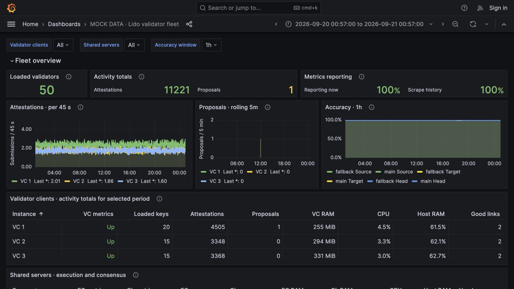
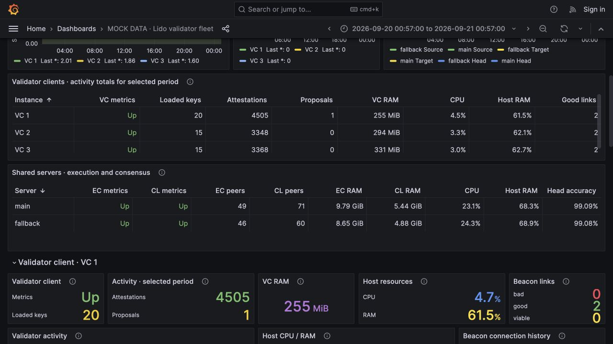
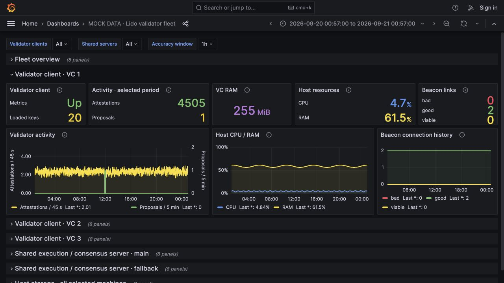
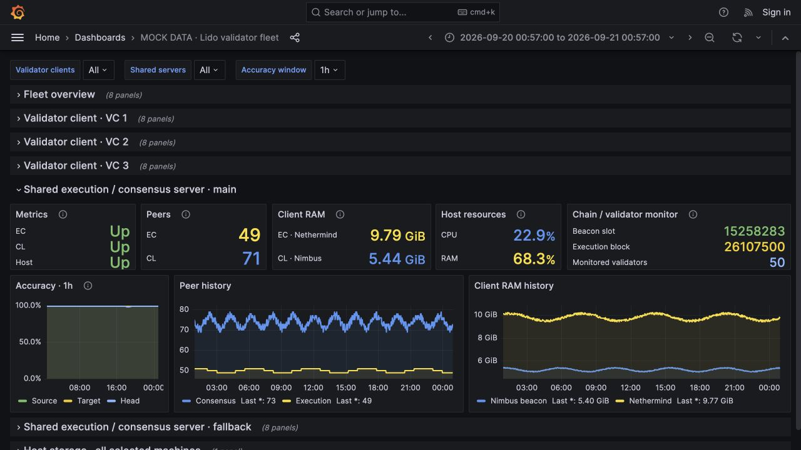
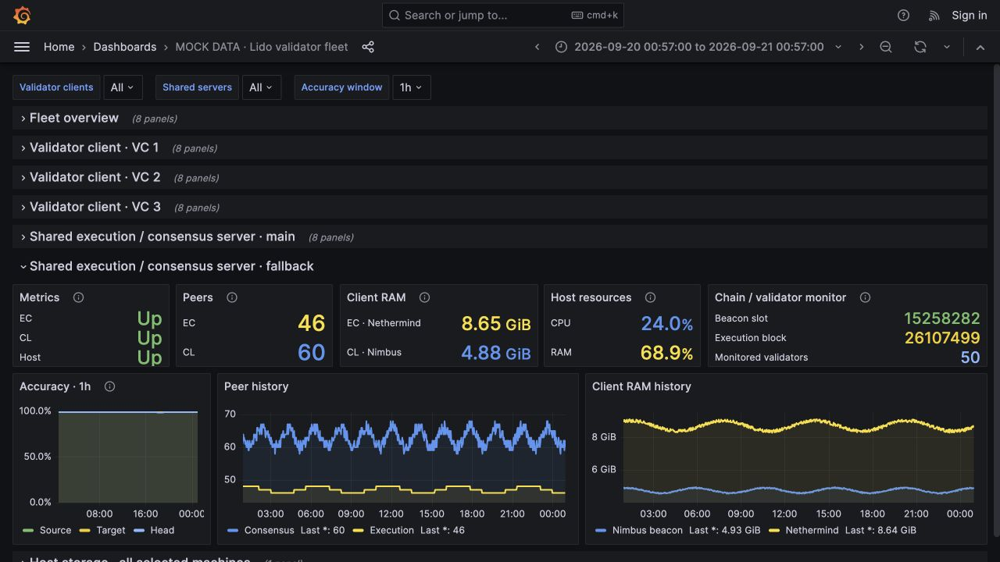

# Dashboard screenshots — 50 validators

Refreshed on 2026-09-21 in Grafana 9.5.18 using the latest dashboard layout and
synthetic Prometheus history. No live servers or production data were used.

| Validator client | Loaded keys |
| --- | ---: |
| VC 1 | 20 |
| VC 2 | 15 |
| VC 3 | 15 |
| Total | 50 |

The illustrative 24-hour history contains approximately 11,221 attestation
submissions and one proposal on VC 1. Both shared beacon nodes monitor the same
mock set of 50 keys; their accuracy series remain independent. Resource usage
and accuracy are examples, not predictions for a 50-validator deployment.

## Current screenshots

1. [Fleet overview](01-fleet-overview.jpg): top summary strip; shorter attestation,
   proposal, and wider accuracy graphs; full Source, Target, and Head labels.
2. [Comparison tables](02-comparison-tables.jpg): all three VCs and both shared servers.
3. [VC overview](03-vc-overview.jpg): VC 1 with 20 loaded keys, activity totals,
   attestation rate, a whole-number proposal, resources, and beacon connections.
4. [Main node overview](04-main-node-overview.jpg): EC/CL availability, peers,
   memory, host resources, chain heads, and attestation accuracy.
5. [Fallback node overview](05-fallback-node-overview.jpg): the fallback server's
   independent EC/CL and host metrics.

All five images use the same data and time range. Unrelated rows were collapsed
for detail views, and every screenshot retains the Grafana MOCK DATA title.

## Gallery

### Fleet overview

### Comparison tables

### VC overview

### Main node overview

### Fallback node overview

## Mock-data presentation

Synthetic attestation counters use continuous positive random increments without
integer quantization to illustrate dense, irregular rate fluctuations. The
preview copy requests up to 1,440 points on attestation charts. This illustrates
the appearance, not individual validator duties. Production queries, point
density, and monitoring configuration were not changed for these screenshots.

Earlier iterations are preserved locally in the ignored `private/preview-history/`
directory and are not included in the public repository.
