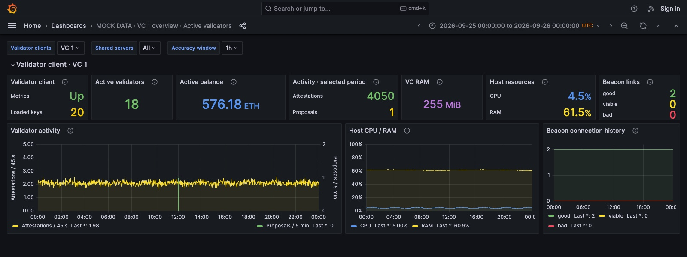

# Active validator layout previews

These are real Grafana screenshots rendered with synthetic TestData, using Grafana 9.5.18. They demonstrate the v0.4.0 layout using mock data, not live monitoring. The production image uses the CSV inventory reader and beacon-state collector instead of these mock queries.




The fleet example has 50 loaded keys, 45 active validators and 1,440.38 ETH in active-validator consensus balances. VC 1 has 20 loaded keys, 18 active validators and 576.18 ETH. Balance means the sum of actual consensus balances for active validators, not effective balance or loaded keys multiplied by 32 ETH. All values are fictional.

Active count and balance sit beside loaded keys. The client table also includes both fields. Resource and beacon-link cards are narrower to accommodate the additions.

To regenerate the two mock dashboard JSON files:

```sh
python3 monitoring/previews/active-validators/build-preview.py --output /tmp/lido-active-preview-dashboards
```

Provision a Grafana TestData datasource with UID `lido-mock`, then import the generated dashboards. The generator reads the production dashboard for styling but does not modify it. No validator keys, live metrics or private deployment configuration are used.
